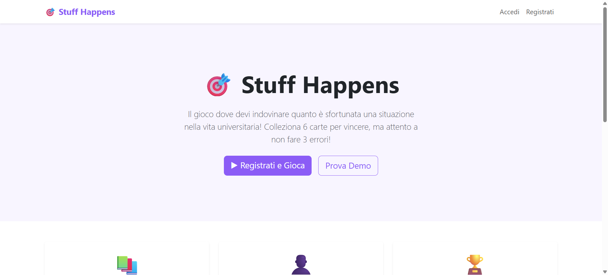
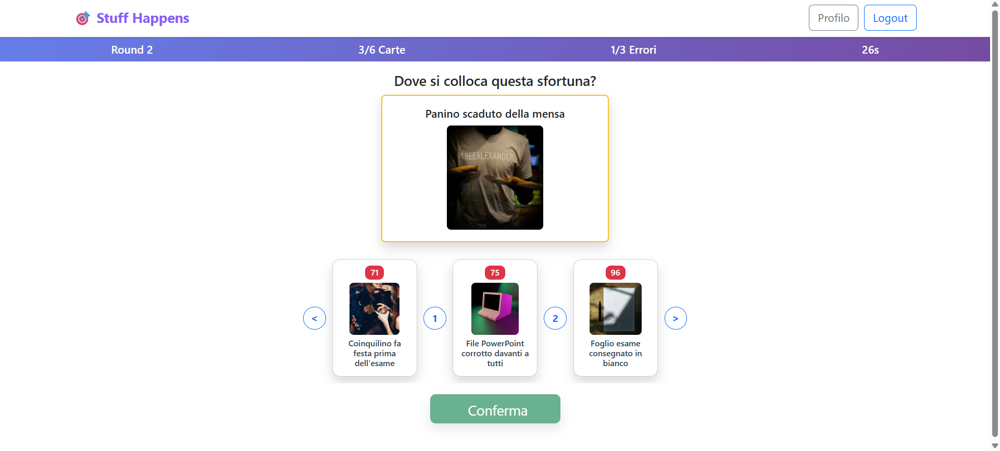

[](https://classroom.github.com/a/uNTgnFHD)

# Exam #1: "Gioco della Sfortuna"

## Student: s346229 BELLANCA RICCARDO

# React Client Application Routes

- Route `/`: Pagina home - pagina principale di atterraggio e punto di ingresso dell'applicazione
- Route `/auth/login`: Pagina di login - autenticazione utente e funzionalità di accesso
- Route `/auth/register`: Pagina di registrazione - creazione nuovo account utente e processo di iscrizione
- Route `/profile/:profileId`: Pagina profilo utente - mostra informazioni del profilo utente e cronologia partite, il parametro `:profileId` specifica l'id univoco del profilo utente da visualizzare
- Route `/game`: Pagina di gioco - interfaccia di gioco principale e funzionalità di gameplay
- Route `/demo`: Pagina demo - interfaccia di gioco dimostrativa e funzionalità di gameplay limitata
- Route `/unauthorized`: Pagina accesso non autorizzato - visualizzata quando l'utente non ha l'autenticazione appropriata (errore 401)
- Route `/forbidden`: Pagina accesso vietato - visualizzata quando l'utente autenticato non ha i permessi richiesti (errore 403)
- Route `/serverError`: Pagina errore server - visualizzata quando si verificano errori lato server (errore 500)
- Route `*`: Pagina non trovata - route di fallback per URL non definiti, visualizza pagina errore 404

## API Server

- POST `/auth/register`

- Descrizione: registra un nuovo utente
- Request body content:

```json
{
  "username": "newuser@example.com",
  "password": "password123",
  "confirmPassword": "password123"
}
```

- Response body content:

```json
{
  "success": true,
  "data": {
    "userId": 1,
    "username": "newuser@example.com"
  }
}
```

- Response code:
  - `201 Created`
  - `400 Bad Request`
  - `409 Conflict` - Un utente con questo username esiste già
  - `500 Internal Server Error`

---

- POST `/auth/login`

- Descrizione: effettua il login dell'utente
- Request body content:

```json
{
  "username": "user@example.com",
  "password": "password123"
}
```

- Response body content:

```json
{
  "success": true,
  "data": {
    "userId": 1,
    "username": "newuser@example.com"
  }
}
```

- Response code:
  - `200 OK`
  - `400 Bad Request`
  - `500 Internal Server Error`

---

- POST `/auth/logout`

- Descrizione: effettua il logout per l'utente corrente
- Response body content:

```json
{
  "success": true,
  "data": { "message": "Logout effettuato con successo" }
}
```

- Response code:

  - `200 OK`
  - `401 Unauthorized`
  - `500 Internal Server Error`

---

- GET `/session`

- Descrizione: recupera le informazioni essenziali dell'utente dalla sessione
- Response body content:

```json
{
  "success": true,
  "data": {
    "userId": 1,
    "username": "newuser@example.com"
  }
}
```

- Response code:
  - `200 OK`
  - `401 Unauthorized`
  - `500 Internal Server Error`

---

- GET `/profile/:profileId`

- Descrizione: recupera le informazioni del profilo utente
- Request body content:

```json
{
  "profileId": 1
}
```

- Response body content:

```json
{
  "success": true,
  "data": {
    "id": 1,
    "username": "user",
    "createdAt": "2025-06-09T18:37:07.330Z",
    "winRate": "33.3",
    "games": {
      "gamesPlayed": 12,
      "gamesWon": 3,
      "gamesLost": 9,
      "datelastGame": "2025-05-13T06:57:47.000Z"
    }
  }
}
```

- Response code:
  - `200 OK`
  - `400 Bad Request`
  - `401 Unauthorized`
  - `403 Forbidden`
  - `500 Internal Server Error`

---

- GET `/profile/:profileId/history`

- Descrizione: recupera la cronologia delle partite dell'utente
- Request body content:

```json
{
  "profileId": 1
}
```

- Response body content:

```json
{
"success": true,
"data":
  {
    "gameId": 1,
    "status": "won",
    "createdAt": "2024-06-01 14:30:00",
    "totalCardsWon": 6,
    "totalCardsLost": 2,
    "rounds": [
      {
        "roundNumber": 1,
        "isWon": 1,
        "playedAt": "2024-06-02 16:20:15",
        "card": {
          "name": "Dita macchiate prima della stretta di mano"
        }
      },
      {
        "roundNumber": 2,
        "isWon": 0,
        "playedAt": "2024-06-02 16:21:45",
        "card": {
          "name": "Telefono scarico con QR code"
        }
      },
    ]
  }
},
```

- Response code:
  - `200 OK`
  - `400 Bad Request`
  - `401 Unauthorized`
  - `403 Forbidden`
  - `500 Internal Server Error`

---

- GET `/game`

- Descrizione: inizia una nuova partita
- Response body content:

```json
{
  "success": true,
  "data": {
    "gameId": 2,
    "round": 1,
    "cardsWon": 0,
    "cardsLost": 0,
    "status": "in_progress",
    "hand": [
      {
        "cardId": 4,
        "name": "Macchia di sugo sulla maglietta",
        "imageUrl": "path4.jpg",
        "misfortuneIndex": 8.5
      },
      {
        "cardId": 25,
        "name": "Posto preferito occupato in biblioteca",
        "imageUrl": "path25.jpg",
        "misfortuneIndex": 49
      },
      {
        "cardId": 46,
        "name": "Computer crash durante esame online",
        "imageUrl": "path46.jpg",
        "misfortuneIndex": 90
      }
    ],
    "challengeCard": {
      "id": 17,
      "name": "Entrata nell'aula sbagliata",
      "imageUrl": "path17.jpg"
    }
  }
}
```

- Response code:

  - `200 OK`
  - `401 Unauthorized`
  - `500 Internal Server Error`

---

- POST `/game/guess`

- Descrizione: invia una tentativo di indovinare durante il gioco
- Request body content:

```json
{
  "position": 3
}
```

- Response body content in caso di successo del tentativo:

```json
{
  "success": true, // Questo consente di indicare se la chiamata HTTP ha funzionato
  "data": {
    "success": true, // Questo serve a segnalare se la posizione era corretta
    "cardDetails": {
      "cardId": 1,
      "name": "Calzini diversi in palestra",
      "imageUrl": "path1.jpg",
      "misfortuneIndex": 3
    },
    "gameStatus": "in_progress",
    "round": 2,
    "cardsWon": 1,
    "cardsLost": 0,
    "hand": [
      {
        "cardId": 1,
        "name": "Calzini diversi in palestra",
        "imageUrl": "path1.jpg",
        "misfortuneIndex": 3
      },
      {
        "cardId": 3,
        "name": "Due scarpe diverse all'università",
        "imageUrl": "path3.jpg",
        "misfortuneIndex": 7
      },
      {
        "cardId": 7,
        "name": "Gomma attaccata sui pantaloni",
        "imageUrl": "path7.jpg",
        "misfortuneIndex": 13.5
      },
      {
        "cardId": 21,
        "name": "Nome storpiato alla laurea",
        "imageUrl": "path21.jpg",
        "misfortuneIndex": 40.5
      }
    ],
    "nextChallengeCard": {
      "id": 11,
      "name": "Inciampo in aula magna",
      "imageUrl": "path11.jpg"
    }
  }
}
```

- Response body content in caso di fallimento del tentativo:

```json
{
  "success": true, // Questo consente di indicare se la chiamata HTTP ha funzionato
  "data": {
    "success": true, // Questo serve a segnalare se la posizione era corretta
    "cardDetails": null,
    "gameStatus": "in_progress",
    "round": 2,
    "cardsWon": 0,
    "cardsLost": 1,
    "hand": [
      {
        "cardId": 3,
        "name": "Due scarpe diverse all'università",
        "imageUrl": "path3.jpg",
        "misfortuneIndex": 7
      },
      {
        "cardId": 7,
        "name": "Gomma attaccata sui pantaloni",
        "imageUrl": "path7.jpg",
        "misfortuneIndex": 13.5
      },
      {
        "cardId": 21,
        "name": "Nome storpiato alla laurea",
        "imageUrl": "path21.jpg",
        "misfortuneIndex": 40.5
      }
    ],
    "nextChallengeCard": {
      "id": 11,
      "name": "Inciampo in aula magna",
      "imageUrl": "path11.jpg"
    }
  }
}
```

- Response code:

  - `200 OK`
  - `400 Bad Request`
  - `401 Unauthorized`
  - `500 Internal Server Error`

---

- GET `/demo`

- Descrizione: inizia una nuova partita demo
- Response body content:

```json
{
  "success": true,
  "data": {
    "gameId": "demo-1749827206340",
    "round": 1,
    "cardsWon": 3,
    "cardsLost": 0,
    "status": "in_progress",
    "hand": [
      {
        "cardId": 8,
        "name": "Starnuti continui in aula",
        "imageUrl": "path8.jpg",
        "misfortuneIndex": 15
      },
      {
        "cardId": 11,
        "name": "Inciampo in aula magna",
        "imageUrl": "path11.jpg",
        "misfortuneIndex": 22
      },
      {
        "cardId": 17,
        "name": "Entrata nell'aula sbagliata",
        "imageUrl": "path17.jpg",
        "misfortuneIndex": 34
      }
    ],
    "challengeCard": {
      "id": 13,
      "name": "Scivolata sulle scale biblioteca",
      "imageUrl": "path13.jpg"
    }
  }
}
```

- Response code:

  - `200 OK`
  - `401 Unauthorized`
  - `500 Internal Server Error`

---

- POST `/demo/guess`

- Descrizione: invia una tentativo di indovinare durante la demo
- Request body content:

```json
{
  "position": 3
}
```

- Response body content in caso di successo del tentativo:

```json
{
  "success": true,
  "data": {
    "success": true,
    "cardDetails": {
      "cardId": 49,
      "name": "File progetto gruppo corrotto",
      "imageUrl": "path49.jpg",
      "misfortuneIndex": 94.5
    },
    "gameStatus": "won",
    "round": 1,
    "cardsWon": 4,
    "cardsLost": 0,
    "hand": [
      {
        "cardId": 14,
        "name": "Caffè versato nello zaino",
        "imageUrl": "path14.jpg",
        "misfortuneIndex": 29
      },
      {
        "cardId": 36,
        "name": "Coinquilino fa festa prima dell'esame",
        "imageUrl": "path36.jpg",
        "misfortuneIndex": 71
      },
      {
        "cardId": 40,
        "name": "Addormentato durante esame importante",
        "imageUrl": "path40.jpg",
        "misfortuneIndex": 78.5
      },
      {
        "cardId": 49,
        "name": "File progetto gruppo corrotto",
        "imageUrl": "path49.jpg",
        "misfortuneIndex": 94.5
      }
    ]
  }
}
```

- Response body content in caso di fallimento del tentativo:

```json
{
  "success": true,
  "data": {
    "success": true,
    "cardDetails": null,
    "gameStatus": "won",
    "round": 1,
    "cardsWon": 3,
    "cardsLost": 1,
    "hand": [
      {
        "cardId": 14,
        "name": "Caffè versato nello zaino",
        "imageUrl": "path14.jpg",
        "misfortuneIndex": 29
      },
      {
        "cardId": 36,
        "name": "Coinquilino fa festa prima dell'esame",
        "imageUrl": "path36.jpg",
        "misfortuneIndex": 71
      },
      {
        "cardId": 40,
        "name": "Addormentato durante esame importante",
        "imageUrl": "path40.jpg",
        "misfortuneIndex": 78.5
      }
    ]
  }
}
```

- Response code:

  - `200 OK`
  - `400 Bad Request`
  - `401 Unauthorized`
  - `500 Internal Server Error`

---

## Database Tables

### Table `utenti`

- **userId**: chiave primaria auto-incrementale
- **username**: univoco, viene utilizzato per fare il login
- **salt**: utilizzato per l'hashing della password
- **hash**: password hashata con salt
- **createdAt**: timestamp di registrazione

Contiene le informazioni degli utenti registrati che possono giocare partite complete e vedere la cronologia.

### Table `carte`

- **cardId**: chiave primaria auto-incrementale
- **name**: nome della situazione orribile (univoco)
- **imageUrl**: URL relativo dell'immagine rappresentativa
- **misfortuneIndex**: indice di sfortuna da 1 a 100 univoco

Contiene tutte le 50+ carte delle situazioni orribili con i loro dettagli e indici di sfortuna univoci.

### Table `partite`

- **gameId**: chiave primaria auto-incrementale
- **userId**: foreign key che referenzia userId della tabella users
- **status**: può essere "in_progress", "won", "lost"
- **createdAt**: timestamp di inizio partita
- **totalCardsWon**: numero di carte vinte nella partita
- **totalCardsLost**: numero di carte perse nella partita

Traccia ogni partita giocata dagli utenti registrati con il suo stato e statistiche finali.

### Table `rounds`

- **roundId**: chiave primaria auto-incrementale
- **gameId**: foreign key che referenzia gameId della tabella games
- **cardId**: foreign key che referenzia cardId della tabella cards
- **roundNumber**: numero progressivo del round nella partita
- **isWon**: boolean che indica se il round è stato vinto
- **playedAt**: timestamp del round

Registra ogni singolo round di una partita, quale carta è stata presentata e se è stata vinta o persa.

## Main React Components

# Componenti React Principali

- `HomePage`: Pagina principale e landing page dell'applicazione, fornisce accesso al gioco e alla demo
- `LoginPage`: Pagina utile per l'autenticazione di utenti esistenti con validazione e gestione login
- `RegisterPage`: Pagina necessaria per la registrazione di nuovi utenti con validazione campi e creazione account
- `GamePage`: Interfaccia di gioco principale con gestione tentativi e salvataggio risultati
- `DemoPage`: Versione demo del gioco senza autenticazione per provare le funzionalità base
- `NavBar`: Barra superiore di navigazione, consente di spostarsi all'interno dell'applicazione

## Screenshot

### HomePage
---


### GamePage
---


## Users Credentials

- Username : `user1`, Password : `password1`
- Username : `user2`, Password : `password2`